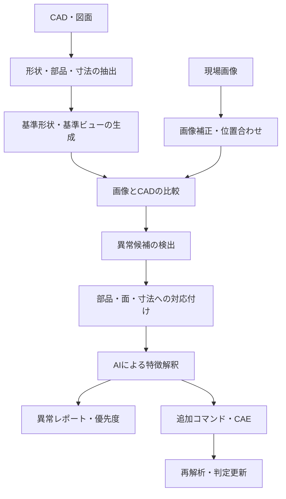
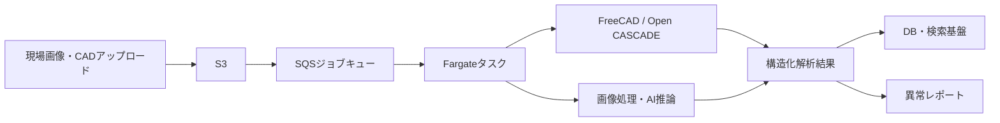

# CAD・図面と現場画像を用いたAI老朽化・異常検知構想

## 1. アイデア概要

CADモデルや図面を基準データとして、現場で撮影した画像と比較し、設備・部品の老朽化や異常箇所を自動検出する。

既に実現している以下の仕組みを、逆方向の検査・解析へ拡張する構想である。

> AIにコマンドを出させ、Fargate上のFreeCADでモデル化・図面化・CAEを実行する。

今回の構想では、FreeCAD/Open CASCADEを「CADを作るエンジン」だけでなく、「CADを読み解き、画像検査の基準を生成するエンジン」として利用する。

---

## 2. 目標

- 図面・CADと現場画像を自動的に対応付ける
- CAD上のどの部品・どの面に異常があるか特定する
- 錆、腐食、亀裂、変形、欠損、漏れなどを検出する
- 異常の位置・面積・長さ・寸法差を数値化する
- AIが異常の種類、原因候補、緊急度、追加確認方法を説明する
- 必要に応じてFreeCADやCAEを呼び出し、影響を検証する

---

## 3. 全体フロー



---

## 4. CAD側で数値化する情報

FreeCAD/Open CASCADEで形状を分解し、AIに渡す前に構造化データへ変換する。

| 分類 | 抽出する情報の例 |
|---|---|
| 部品構造 | パーツ数、ボディ、ソリッド、親子関係、部品ID |
| 形状 | 面・辺・頂点数、円柱、穴、ポケット、フィレット、面取り |
| 寸法 | 長さ、幅、高さ、穴径、深さ、角度、板厚 |
| 物性・幾何量 | 体積、表面積、重心、慣性モーメント、Bounding Box |
| 配置 | 座標、回転、アセンブリ内の位置、接続関係 |
| 属性 | 材料、色、レイヤー、部品名、製造情報 |
| 解析情報 | 応力、変位、温度、固有値、危険領域 |

### AIに渡すデータ例

```json
{
  "part_id": "P-001",
  "name": "support_bracket",
  "bbox_mm": [100, 80, 40],
  "volume_mm3": 125000,
  "surface_area_mm2": 18400,
  "features": [
    {
      "type": "cylindrical_hole",
      "diameter_mm": 20,
      "depth_mm": 35,
      "axis": [0, 0, 1]
    }
  ],
  "material": null,
  "assembly_pose": {
    "translation_mm": [1200, 350, 800],
    "rotation_deg": [0, 90, 0]
  }
}
```

単なる数値一覧だけでなく、部品・形状特徴・寸法・接続関係をグラフ化すると、AIが部品の役割や異常の意味を理解しやすくなる。

---

## 5. 画像から検出する異常

| 異常カテゴリ | 画像で見る特徴 | CAD・図面との連携 |
|---|---|---|
| 錆・腐食 | 色、質感、範囲、表面の荒れ | 該当する面・材料・板厚 |
| 亀裂・割れ | 細い線、分岐、長さ、方向 | 応力集中部、溶接部、穴周辺 |
| 変形 | 輪郭のずれ、膨らみ、傾き | 基準形状との差分、変位量 |
| 欠損 | 部品・ボルト・カバーの消失 | BOM、アセンブリ構造 |
| 漏れ・汚染 | 油染み、水滴、流出跡 | 配管・シール・接続部 |
| 塗装・表面異常 | 剥離、変色、膨れ | 材料、保護層、保守履歴 |
| 改造・変更 | 設計にない部品や穴 | 図面との差分、変更履歴 |

「老朽化」という最終判断を画像AIだけに任せず、画像上の異常、CAD上の該当部品、寸法差、過去履歴を組み合わせて判定する。

---

## 6. CADと画像の位置合わせ

比較の精度を左右する最重要工程。

### 基本方式

1. CADの座標系・部品ID・基準面を確定する
2. カメラ位置・向き・焦点距離を推定する
3. CADを同じ視点でレンダリングする
4. 現場画像とCAD投影画像を位置合わせする
5. 輪郭、面、穴、部品位置を比較する

### 位置合わせに使えるもの

- 既知寸法の部品や穴
- AprilTag、ArUcoマーカー
- 基準点、ボルト、角部、円形特徴
- カメラの撮影位置・姿勢情報
- 複数画像による三次元復元
- 深度カメラ、LiDAR、フォトグラメトリ

単一画像だけでは絶対寸法や裏側の状態を確定しにくいため、寸法基準・複数視点・深度情報を組み合わせるほど信頼性が高くなる。

---

## 7. AIの役割分担

| 処理 | 担当 | 理由 |
|---|---|---|
| CAD形状の抽出 | FreeCAD/Open CASCADE | 正確な幾何計算が必要 |
| 寸法・体積・面積計算 | CADエンジン | 決定論的に計算する |
| 画像補正・位置合わせ | 画像処理/CV | 再現性を確保する |
| 錆・亀裂・変色の検出 | 画像AI | 見た目の特徴を認識する |
| 部品・面への対応付け | ルール + AI | 幾何情報と意味理解を組み合わせる |
| 原因・優先度の説明 | 大規模言語モデル | 複数情報を統合して説明する |
| 応力・強度への影響 | CAE | 工学的な影響を計算する |

AIは「形状計算の代替」ではなく、正確に抽出されたCAD情報と画像特徴を解釈する役割に置く。

---

## 8. Fargate上の実行構成



Fargateでは、1案件または1画像セットを1ジョブとして処理する構成が扱いやすい。

- S3：CAD、図面、画像、解析結果の保存
- SQS：解析ジョブの待ち行列
- Fargate：FreeCAD、Python、画像処理、AI呼び出し
- DB：部品ID、検査履歴、異常履歴、信頼度
- 検索基盤：類似部品・過去異常・類似画像の検索

重いレンダリング、大規模メッシュ、GPU推論が中心になる場合は、FargateではなくGPU付きEC2などを一部併用する。

---

## 9. 異常判定の出力例

```json
{
  "inspection_id": "INS-2026-0001",
  "part_id": "P-001",
  "anomaly": {
    "type": "corrosion",
    "severity": "medium",
    "confidence": 0.91,
    "image_area_ratio": 0.083,
    "estimated_location": "front_vertical_face"
  },
  "evidence": [
    "orange-brown surface texture",
    "designated steel surface",
    "abnormality not present in previous inspection"
  ],
  "recommended_action": "clean and inspect thickness; prioritize within 30 days"
}
```

実運用では、判定結果に必ず以下を添付する。

- 異常箇所をマーキングした画像
- 対応するCAD部品・面のID
- 判定根拠
- 信頼度
- 過去画像との差分
- 人による確認が必要かどうか

---

## 10. CAEとの連携

画像から得た腐食範囲や変形量をFreeCADモデルへ反映し、CAEを再実行できる。

```text
画像から腐食・欠損・変形を検出
        ↓
CAD形状または板厚・材料条件を更新
        ↓
メッシュ再生成
        ↓
応力・変位・安全率を再計算
        ↓
異常が構造安全性に与える影響を評価
```

例えば、腐食による板厚減少を仮定して、応力集中や安全率の変化を算出する。ただし、画像だけから腐食深さを確定できない場合は、厚さ測定や非破壊検査の結果を追加条件として使う。

---

## 11. MVPの進め方

### Phase 1：見える異常の検出

- CADと現場画像を登録
- 部品IDを手動または半自動で対応付け
- 錆、塗装剥離、欠損を検出
- 異常箇所を画像上に表示

### Phase 2：CADとの自動対応付け

- CADから部品・面・基準寸法を抽出
- カメラ姿勢またはマーカーによる位置合わせ
- 異常をCADの部品ID・面IDへ紐付け
- 検査履歴を蓄積

### Phase 3：寸法差・変形の数値化

- 複数画像または深度データを利用
- CAD基準形状との差分を算出
- 変形量、腐食面積、欠損範囲を計測

### Phase 4：CAEによる影響評価

- 画像・測定データをCADへ反映
- メッシュ・CAEを自動実行
- 安全率、応力、変位の変化をレポート

---

## 12. 主な課題と対策

| 課題 | 対策 |
|---|---|
| 照明・影・汚れの影響 | 撮影条件の標準化、画像補正、複数画像 |
| CADと現物の姿勢が違う | マーカー、特徴点、カメラ姿勢推定 |
| 画像に写らない部分 | 複数視点、内視鏡、超音波、厚さ測定 |
| 錆と単なる汚れの混同 | 過去画像、材質、表面状態、追加検査 |
| 亀裂の深さが分からない | 非破壊検査と組み合わせる |
| AIの誤判定 | 信頼度、人による承認、根拠画像を保存 |
| 部品名や図面表記の揺れ | 部品ID・属性・辞書による正規化 |
| 大規模モデル・GPU処理 | FargateとGPU付き実行環境を使い分ける |

---

## 13. 構想の核心

このシステムの価値は、単に画像から「異常あり」と判定することではない。

> **図面・CAD上のどの部品の、どの面に、どの種類の異常があり、それが設計性能や安全性にどの程度影響するかを、数値と根拠付きで説明すること。**

既に実現している「AIがFreeCADを操作してモデル・図面・CAEを生成する仕組み」と組み合わせることで、次の循環が作れる。

```text
設計情報
  → 現場画像の検査
  → 異常の数値化
  → CAD/CAEへの反映
  → 影響評価
  → 補修案・設計変更案の生成
```

最終的には、設計・検査・解析・補修提案を一つのAI/CADループに統合できる。

---

## 14. 一言で表すと

**「設計データを理解したAIによる、説明可能な画像ベース設備診断システム」**

