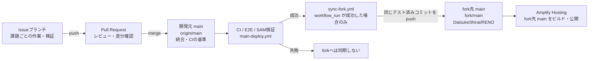

# ブランチ運用と fork 同期フロー

## この図の前提

このリポジトリでは、開発元リポジトリの `main` を変更の統合先とし、テストに成功したコミットだけを fork 側の `main` に同期します。Amplify Hosting は fork 側の `main` をデプロイ元として参照します。

リモート名は次の意味です。

- `origin`: 開発元 `IFLAG-hps/RENO`
- `fork`: fork 先 `DaisukeShirai/RENO`

## ブランチ間の関係

## 各ブランチの位置づけ

| 対象 | 役割 | 主な操作 | 公開環境への影響 |
| --- | --- | --- | --- |
| issueブランチ | Issue単位の実装、修正、ローカル検証を行う作業場所 | `push`、PR作成・更新 | 原則として fork と Amplify は更新しない |
| 開発元 `main` | レビュー済み変更を統合し、CIの基準にするブランチ | PRをmerge、CIを実行 | CI成功後に fork 同期の起点になる |
| fork先 `main` | Amplify が参照するデプロイ用ミラー | GitHub Actionsからテスト済みコミットをpush | Amplify Hostingのビルド・公開が開始される |

## 通常の作業フロー

1. Issueごとに作業ブランチを作成し、変更をコミットして push する。
2. 作業ブランチから開発元 `main` への Pull Request を作成する。
3. レビュー後、PRを開発元 `main` にmergeする。
4. `main-deploy.yml` が LocalStack、SAM、E2E などの検証を実行する。
5. CIが成功すると `sync-fork.yml` が起動し、そのワークフローで検証したコミットを fork先 `main` に同期する。
6. Amplify Hosting が fork先 `main` の更新を検知してビルド・公開する。

## 運用上の注意

- fork先 `main` へは、手動で別のコミットを pushせず、同期ワークフローによる更新を基本とする。
- CIが失敗した場合は fork先 `main` へ同期されないため、失敗原因を修正してから再度PRを更新する。
- fork先 `main` はデプロイのトリガーになるため、公開結果の確認は fork 同期後に行う。
- AWSバックエンドのデプロイは、`main` のCI成功後に必要に応じて手動実行する構成であり、fork同期とは別の操作である。

## 関連設定

- [GitHub Actions運用](../github-actions運用.md)
- [`main-deploy.yml`](../../.github/workflows/main-deploy.yml)
- [`sync-fork.yml`](../../.github/workflows/sync-fork.yml)
