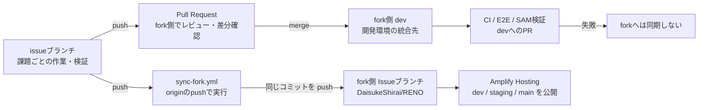
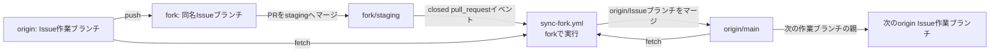

# ブランチ運用と fork 同期フロー

## この図の前提

このリポジトリでは、`origin`（開発元）でIssueブランチを実装し、pushされた同名ブランチを`fork`へ自動同期します。自動テストは`fork`のIssueブランチから`dev`へPRを出した時点で実行します。その後、`staging`、`main`へPRで昇格します。Amplify Hostingは`fork`側の環境ブランチを参照します。

リモート名は次の意味です。

- `origin`: 開発元 `IFLAG-hps/RENO`
- `fork`: fork 先 `DaisukeShirai/RENO`
- Issueブランチ: `[Issue番号]-<内容>`（例：`30-実装-相談セッション履歴api`）

## ブランチ間の関係

## staging 昇格時の origin/main 更新

forkのIssueブランチを`staging`へ直接PRマージした場合、fork側で実行される`sync-fork.yml`が同じIssueブランチを`origin/main`へマージします。これにより、次のIssueブランチを`origin/main`から作成しても、受入済みの変更を親にできます。`dev`から`staging`への環境昇格はIssueブランチではないため、このマージ対象にはなりません。

## 各ブランチの位置づけ

| 対象 | 役割 | 主な操作 | 公開環境への影響 |
| --- | --- | --- | --- |
| originのIssueブランチ | Issue単位の実装、修正、ローカル検証を行う作業場所 | `push`、CI実行 | CI成功後にforkへ自動同期 |
| forkのIssueブランチ | CI成功済みIssueブランチの読み取り専用ミラー | GitHub Actionsからpush | `dev`へのPR元になる |
| fork `dev` / `staging` / `main` | 開発・受入・公開環境の統合先 | PRをmerge | Amplifyの各環境を更新 |

## 通常の作業フロー

1. `fork/main`を基点に、`origin`で`[Issue番号]-<内容>`のIssueブランチを作成する。
2. Issueブランチを`origin`へpushし、`main-deploy.yml`で検証する。
3. CIが成功すると、`sync-fork.yml`が同名ブランチを`fork`へ自動同期する。
4. `fork`のIssueブランチから`fork/dev`へのPull Requestを作成する。
5. `dev`で確認後、`staging`、`main`へ順にPRで昇格する。
6. Amplify Hostingが各環境ブランチの更新を検知してビルド・公開する。

## 運用上の注意

- forkのIssueブランチへは手動でコミットせず、同期ワークフローによる更新を基本とする。
- CIが失敗した場合はforkへ同期されないため、失敗原因を修正して再度pushする。
- `fork/dev`、`fork/staging`、`fork/main`への直接pushは禁止し、必ずPRで昇格する。
- AWSバックエンドのデプロイは、環境ブランチのCI成功後に必要に応じて手動実行する。

## 関連設定

- [GitHub Actions運用](../github-actions運用.md)
- [`main-deploy.yml`](../../.github/workflows/main-deploy.yml)
- [`sync-fork.yml`](../../.github/workflows/sync-fork.yml)
