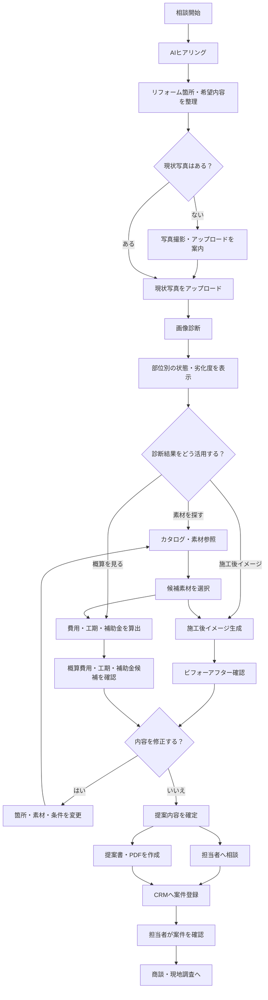

# 全体ワークフロー

## 概要

画像診断、カタログ参照、費用・工期・補助金、CRM連携を、既存のリフォーム相談フローに組み込んだ全体像です。

## フロー図



## 利用者から見たメインの流れ

```text
相談
→ 写真アップロード
→ 画像診断
→ 素材選び
→ 施工後イメージ
→ 費用・工期・補助金確認
→ 提案書作成
→ CRM登録
→ 担当者対応
```

## 設計方針

- 画像診断は写真アップロード後に案内する
- 診断結果から、素材・画像生成・概算のいずれにも進める
- 画像診断は基本導線に含めるが、ユーザーがスキップできる余地を残す
- 素材・診断・概算の結果は、最終的に提案内容へまとめる
- 担当者への相談や提案書作成を、CRM登録につなげる

## レビュー項目

- 画像診断を必須にするか、スキップ可能にするか
- カタログ、画像生成、概算の順番は適切か
- 提案書作成とCRM登録の順番は適切か
- 途中で別の部屋・部位へ切り替えられる必要があるか
- 担当者へ引き継ぐタイミングは適切か

